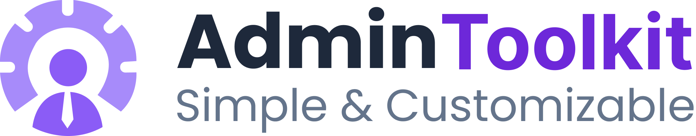

<div align="center">
  
  <p align="center">
    TailwindCSS Based Admin Dashboard Template
  </p>
</div>

## 📌 Introduction

**AdminToolkit -** is a modern admin dashboard template that comes with a variety of useful features and functionalities. It is built using TailwindCSS, a popular CSS framework that provides a simple and intuitive approach to building responsive UIs. The template includes over 50 pre-built pages, each designed with a focus on usability and user experience. These pages cover a wide range of use cases, including dashboards, analytics, products management, user management, invoice management and more.

In addition to its pre-built pages, **AdminToolkit** comes with a wide range of UI components and utility classes. These include icons, buttons, tables, forms, and charts, among others. These components and utility classes are carefully designed to provide a seamless user experience, while also being highly customizable. This allows developers to create unique designs that match their brand identity and project requirements.

Overall, **AdminToolkit** is an excellent choice for developers who are looking for a developer-friendly and highly customizable admin dashboard template. It’s intuitive design, wide range of pre-built pages, useful UI components and utility classes make it the best choice for creating modern and responsive admin dashboards.

## 📌 Features

- Based on Tailwindcss 3.x+
- Light & Dark theme support
- Auto-detect theme from user device preference
- Pre-built UI components
- Pre-built apps layout
- 50+ Pages
- Responsive layout
- Easily Customizable
- Developer friendly
- Organized codebase

## 📌 Installation

**1. Clone the repository**

```bash
git clone git@github.com:mostafizurhimself/admintoolkit-html.git
```

**2. Install dependencies**

```bash
yarn install
```

**3. Start development server**

```bash
yarn dev
```

**4. Build for production**

```bash
yarn build
```

**5. Preview production build**

```bash
yarn start
```

## 📌 Contribution

If you're interested in contributing to Admin Toolkit, Please read our [contributing docs](CONTRIBUTING.md) before submitting a pull request.

## 📌 License

[MIT](./LICENSE)

## 📌 Todo

- [ ] RTL support
- [ ] Language Support
- [ ] React version
- [ ] Vue version
- [ ] Angular version
- [ ] Laravel version

<a href="https://www.buymeacoffee.com/mostafizur" target="_blank"></a>
